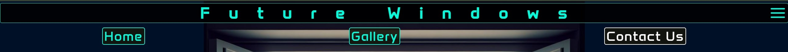
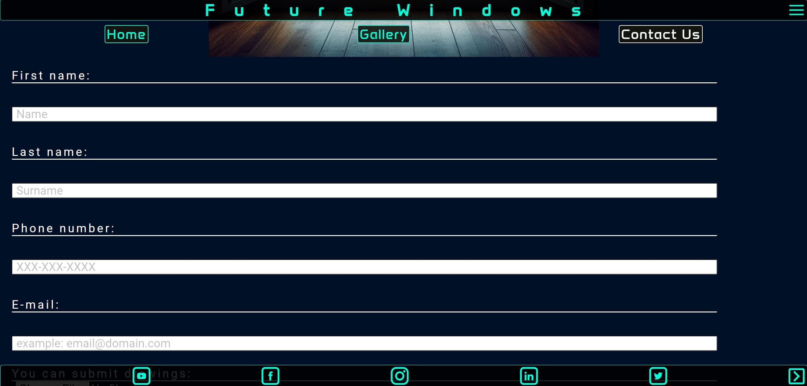
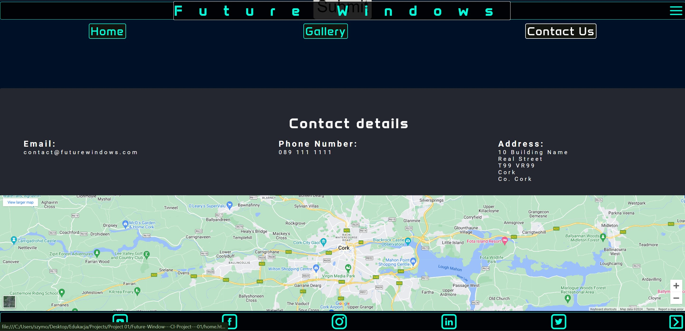
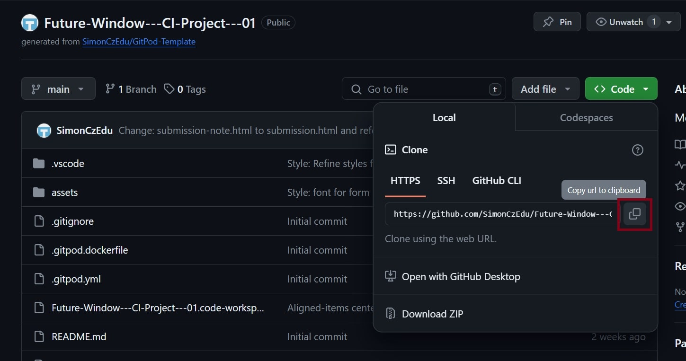

# **_Future Windows_**

Future Windows is a concept for a site of a fictional windows-selling company. It is focused on showcasing layout, features and potential products. It is scalable and has great potential to be further developed based on user/customer feedback.

You can find the deployed site at <a href="https://simonczedu.github.io/Future-Window---CI-Project---01/index.html" target="_blank" rel="noopener">Future Windows</a>

# Contents

* [**User Experience UX**](<#user-experience-ux>)
    * [Wireframes](<#wireframes>)
    * [Site Structure](<#site-structure>)
    * [Design Choices](<#design-choices>)
    *  [Typography](<#typography>)
    *  [Color Scheme](<#color-scheme>)
* [**Features**](<#features>)
    * [**Home**](<#Home>)
         * Who, What, How sections
         * [Nav bar](<#navBar>)
         * [Footer](<#footer>)
         * Background explosion video
    * [**Gallery**](<#gallery>)
        * Light
        * Cold
    * [**Contact Us**](<#contact-us>)
       * Contact form
       * Contact details
       * iframe map
    * [**Form Confirmation**](<#form-confirmation>)
    * [**Future Features**](<#future-features>)
* [**Technologies Used**](<#technologies-used>)
* [**Testing**](<#testing>)
* [**Deployment**](<#deployment>)
* [**Credits**](<#credits>)
    * [**Content**](<#content>)
    * [**Media**](<#media>)
*  [**Acknowledgments**](<#acknowledgments>)

# User Experience (UX)

## User Stories

* As a user I want to be able to navigate through the whole site smoothly.
* As a user I want to understand the purpose of the site upon loading it.
* As a user I want to easily be able to contact Future Windows for more information.
* As a user I want to see product samples.
* As a user I want to be able to provide a feedback/ask questions directly to the company.
* As a user I want to connect with Future Windows on social media.

[Back to top](<#contents>)

## Wireframes

The wireframes for Future Windows were produced in [Balsamiq](https://balsamiq.com). There are frames for a full-width display and a small mobile device. The final site varies from the wireframes due to developments that occurred during the development process. 

* Desktop WireFrame

## Site Structure

Future Windows website has 3 main pages plus a "Thank you" page for form submission. The [Home](index.html) is the default loading page, the [Gallery](gallery.html), and [Contact Us](form.html) pages are all accessible primarily from the navigation menu. The [Submission note](submission.html) is displayed upon submitting the form. [Gallery](gallery.html) also has internal navigation to quickly and easily 'jump' to Light and Cold sections of photographs. All navigation can be hidden with checkboxes at any time and is by design always visible (position:fixed).
 
[Back to top](<#contents>)

## Design Choices

 * ### General design philosophy
    There are a few major intentions in the design of Future Windows:
    * To appear modern, futuristic even and the products that Future Windows offers are also modern and innovative.
    * Windows are transparent and so will be the majority of elements on this site.
    * The compact form of the site is to underline the nature of the products it features. Their design is also minimalistic.
    * Initial contact with the page needs a 'wow' factor, to draw the attention of the user and give them a sense of dealing with a professional company, with resources to back their claims.
    * Design started from an idea of a background video providing that 'wow' factor with a 'bang'.

 * ### Typography
      Font family 'Anta' is set for the body, so it will always be the default font in the absence of any other style. For the main elements of the [Home](index.html) and [Contact Us](form.html) 'Roboto' was chosen instead. 'Roboto' is featured in  the 'Who, What, How' sections of the [Home](index.html) and in the entirety of the form in [Contact Us](form.html)
    
    *  'Anta' was chosen for the header (title and nav elements) to give the user an initial futuristic feel. The aim is to invoke the feeling that Future Windows is from the future and can take users there. It fits more general design philosophy mentioned above.
    * 'Roboto' is used for pretty much the same reason, but it feels more readable, especially when there is more text, or when a font is smaller.

[Back to top](<#contents>)

  * ### Color Scheme
    The color scheme was dictated in no small part by the background video choice. The whole design process started with choosing that video and so, the color scheme is kept in 'blues'. The background is in videos dark blue. It invokes the idea of deep space and thus futurism. The header and footer fonts and border colors were matched using [Compliance Contrast Checker](https://adasitecompliance.com/ada-color-contrast-checker/), but also care was taken to choose a color that would invoke the feel of neon light for future themes. White for the :active selector was confirmed with [Compliance Contrast Checker](https://adasitecompliance.com/ada-color-contrast-checker/), and felt good on tests with users. 
    
    As mentioned above, a big part of the design is also the use of transparency so items overlap and move behind each other. This affects how some colors are displayed, but through testing, satisfying results were reached, and with a negligible hit to readability.

* Color scheme

[Back to top](<#contents>)

# Features

The Future Windows site is set up to be a bit provocative but easy to use. It contains many features that the user would probably be familiar with, such as a navigation bar and contact form. The overall feel of the website is intended to be inviting and thought-provoking. Usage should be intuitive but also feel modern. For that purpose philosophy of "navigation bar is there when you need it and you can hide it when you don't" was applied.  

## Existing Features 

  * ### Home
    
    * [Home page](index.html) is the first page to load
    * It features 3 sections that answer questions: Who the Future Windows are What they do and How they do it.
    * It features semi-transparent images, text and background to showcase background animation. A spark that illuminates the darkness in the explosion.

  * ### navBar

    * Sited at the top of all the pages on the site, it is fully responsive and contains links to all the pages of the site to enable ease of navigation in one convenient location.
    * It is also possible to hide it to gain more real estate.
    * The logo is clickable with a link back to the home page for enhanced UX.

* Nav bar on

* Nav bar off on the Gallery page

[Back to top](<#contents>)

* ### Footer
    
    * Contains social media links. To enhance the UX the links open in other tabs.
    * The social media will encourage users to reach out, and promote (by sharing) the Future Windows brand.
    * Just like the navBar footer is in a fixed position and can be hidden with a press of a button.

* Footer ON

* Footer OFF

[Back to top](<#contents>)

  * ### Gallery

      * The [Gallery](gallery.html) is featured on its dedicated page.
      * It is divided into two sections which reflect two aspects of the products of Future Windows: "Letting the light in and keeping the cold out".
      * The [Gallery](gallery.html) features extra links visible only on that page for easier navigation through its extensive gallery of photos.
      * A responsively styled grid of images of products gives the user a view of what Future Windows can achieve. It is intended more of an appetizer before the customer dives into technologies [Future Features](<#future-features>). 

* Gallery

[Back to top](<#contents>)

  * ### Contact Us
    * This section is an invitation to contact the company for a quotation or to provide feedback.
    * Customers can also attach (optional) files needed to produce a quote.
    * The page features contact details for more traditional forms (email, phone, address)
    * At the bottom of the page, Google Maps is featured through iframe (except Galaxy Fold on portrait view - more info in bug fixing section). It is not linked to any address as Future Windows is a fictional company. However, that can be easily remedied as needed with the Google Maps 'embed' feature. 

* Contact Form

* Contact Info and map

[Back to top](<#contents>)

* ### Form Confirmation
    * This page is a 'thank you' note for the form submission.
    * This will let customers know that their form was submitted and Future Windows will be in contact.
    * This page is a copy of the contacts page with the hero image and the contact details. It does not need form anymore (it could confuse the customer), nor the map. The page has [Contact Us](form.html) active, but that is only for appearances. 

* Submission confirmation

[Back to top](<#contents>)

## Future Features 

* A new section "Products":
    * This would include product descriptions alongside the photos. Windows are not sold by model, so this would have to feature a description of a 'system' (i.e triple glazing) and an example of an installed window as well as a horizontal slice of a window frame. This would make it distinct from the gallery that is purely for visual impact. The gallery can feature fully installed windows rather than a technical representation of how it works.
* Animations for the front page elements. 
    * Purely for a more 'wow' effect and to make it look more dynamic.
    * The idea is that after 'the explosion' plays out, sections slide in to take center stage on the [Home](index.html) page. On the vertical view side sections slide in from left and right, and the middle one from the top. On horizontal it would be either lef>right; right>left; left>right or all in the same direction, but with different delays.
* Actual file dump for the form linked up with a spreadsheet to sort potential customers and contact base.

[Back to top](<#contents>)

# Technologies Used

* [HTML5](https://html.spec.whatwg.org/) - basic content and structure for the website.
* [CSS](https://www.w3.org/Style/CSS/Overview.en.html) - styling.
* [Balsamiq](https://balsamiq.com/wireframes/) - concept wireframes.
* [Visual Studio Code](https://code.visualstudio.com/) - IDE used to develop, edit, commit and push the code to GitHub.
* [Github](https://github.com/) - used as a repository for the project and to deploy a public version of the Future Windows.

[Back to top](<#contents>)

# Testing

Detailed [testing (opens in a new window)](TESTING.md) of Future Windows.

[Back to top](<#contents>)

# Deployment

### **To deploy the project**

The site was deployed to GitHub pages. The steps to deploy a site are as follows:
  1. In the GitHub repository, navigate to the **Settings** tab.
  2. Once in Settings, navigate to the **Pages** tab on the left-hand side.
  3. Under **Source**, select the branch to **master**, then click **Save**.
  4. Once the master branch has been selected, the page will be automatically refreshed with a detailed ribbon display to indicate the successful deployment.

  The live link to the Github repository can be found here - https://github.com/SimonCzEdu/Future-Window---CI-Project---01

### **To fork the repository on GitHub**

A copy of the GitHub Repository can be made by forking the GitHub account. This copy can be viewed and changes can be made to the copy without affecting the original repository. Take the following steps to fork the repository;
1. Log in to **GitHub** and locate the [repository](https://github.com/SimonCzEdu/Future-Window---CI-Project---01).
2. On the right-hand side of the page in line with the repository name is a button called **'Fork'**, click on the button to create a copy of the original repository in your GitHub Account.

### **To create a local clone of this project**

Below is the method for cloning a project from GitHub:

1. Under the repository’s name, click on the **code** tab.
2. In the **Clone with HTTPS** section, click on the clipboard icon to copy the given URL.

3. In your IDE of choice, open **Git Bash**.
4. Change the current working directory to the location where you want the cloned directory to be made.
5. Type **git clone**, and then paste the URL copied from GitHub.
6. Press **enter** and the local clone will be created.

[Back to top](<#contents>)

# Credits
### Content & Media

* Favicon - [favicon page](https://favicon.io/) ; 
* [Balsamiq](https://balsamiq.com/wireframes/) was used to create the wireframes.
* Icon by pitr - at [openclipart](https://openclipart.org/detail/22313/window-icon)
* A background animation by ko_tewan - at [vecteezy](https://www.vecteezy.com/video/2018528-dust-particle-explosion-in-space) (edited by Szymon Czapiewski)
* Hero image and filler photos for the gallery by AI art generator - at [Copilot](https://www.bing.com/images/create?FORM=GDPCLS)
* The photos were compressed using - at [Compressor](https://imagecompressor.com/).
* Yum Cheol-Ho- at [unsplash](https://unsplash.com/photos/white-wooden-framed-glass-window-LumHIwjuQeA)
* Bernard Hermant - at [unsplash 1](https://unsplash.com/photos/clear-glass-door-in-white-frame-uQNmPscyWg0); 
                       [unsplash 2](https://unsplash.com/photos/closed-clear-glass-windows-of-white-building-u8OMbY5D0aI)
* Klara Kulikova - at [unsplash](https://unsplash.com/photos/a-kitchen-counter-with-a-bowl-of-fruit-on-it-igqC8KKZU5w)
* Lasse Møller - at [unsplash](https://unsplash.com/photos/glass-window-facing-sea-0TLId2pjnKk)
* Andrea Davis - at [unsplash](https://unsplash.com/photos/white-and-brown-concrete-building-during-daytime-aY-85GW-oJ4)
* Étienne Beauregard-Riverin - at [unsplash](https://unsplash.com/photos/windowpanes-at-the-building-B0aCvAVSX8E)
* Akin Cakiner - at [unsplash](https://unsplash.com/photos/gray-concrete-building-iN0A4ghszXU)
* MD Duran - at [unsplash](https://unsplash.com/photos/white-and-black-table-and-chairs-near-blue-sea-during-daytime-fnLsyDakJ3A)
* Kelly Arnold - at [unsplash](https://unsplash.com/photos/binoculars-on-dinette-table-near-glass-window-txcBJYqkYwU)
* Christian Wiediger - at [unsplash](https://unsplash.com/photos/low-angle-photography-of-high-rise-building-under-cloudy-sky-ssKEI4HRRtI)
* Roberto Nickson - at [unsplash](https://unsplash.com/photos/a-person-sitting-on-a-couch-looking-out-a-window-_BhA2i8-A20)
* Philip Myrtorp - at [unsplash](https://unsplash.com/photos/white-window-curtain-during-daytime-SjItNYPkGV4)
* Andrea Davis - at [unsplash](https://unsplash.com/photos/white-bed-linen-near-window-TYkSzj7LKnM)
* Deconovo - at [unsplash](https://unsplash.com/photos/brown-wooden-table-with-chairs-2Xa_7vuFvOk)
* sq-lim - at [unsplash](https://unsplash.com/photos/woman-in-black-tank-top-and-blue-denim-shorts-sitting-on-brown-wooden-chair-FdioeCtP734)
* Toa Heftiba - at [unsplash](https://unsplash.com/photos/ceramic-mugs-on-table-7--lTmTpDFA)
* Ruth Troughton - at [unsplash](https://unsplash.com/photos/view-of-snowy-mountain-LVRvaYaWOeg)
* Sebastian Staines - at [unsplash](https://unsplash.com/photos/white-wooden-framed-glass-window-near-body-of-water-9dfJQx-ez3U)
* Magnus Östberg - at [unsplash](https://unsplash.com/photos/yellow-flowers-near-body-of-water-during-daytime-JJRAbv7ex3w)
* Tanner Van Dera - at [unsplash](https://unsplash.com/photos/a-laptop-computer-sitting-on-top-of-a-wooden-desk-oaQ2mTeaP7o)
* Francesca Tosolini - at [unsplash](https://unsplash.com/photos/beige-couch-and-armchair-tHkJAMcO3QE)
* Laura Cleffmann - at [unsplash](https://unsplash.com/photos/white-framed-glass-window-during-daytime-z3drmcczVTc)
* Laura Lauch - at [unsplash](https://unsplash.com/photos/brown-and-black-sofa-set-fXN1pj6ZUSI)
* Andriyko Pdilnyk - at [unsplash](https://unsplash.com/photos/black-bar-stool-near-glass-window-bdmdX_XMcV4)
* Dane Deaner - at [unsplash](https://unsplash.com/photos/beige-wooden-conference-table-_-KLkj7on_c)
* Meral Avdanlı - at [unsplash](https://unsplash.com/photos/black-wooden-framed-glass-window-uWpcJhrDwog)
* The Anchor - at [unsplash](https://unsplash.com/photos/brown-wooden-table-near-window-ACtEE_FcaRU)
* Roméo A. - at [unsplash](https://unsplash.com/photos/blue-glass-window-during-daytime-XKE4pDQRM_M)
* Mike Petrucci - at [unsplash](https://unsplash.com/photos/brown-wooden-pull-wagon-near-trees-covered-by-snow-yqXTfgU8OB4)
* Roberto Nickson - at [unsplash](https://unsplash.com/photos/gray-padded-chaise-couch-beside-window-rEJxpBskj3Q)
* Khamkéo Vilaysing - at [unsplash](https://unsplash.com/photos/clear-glass-window-ciyy63hP7HA)

[Back to top](<#contents>)

# Acknowledgments

The site was completed as a Portfolio 1 Project piece for the Full Stack Software Developer (e-Commerce) Diploma at the [Code Institute](https://codeinstitute.net/). As such I would like to thank my mentor [Precious Ijege](https://www.linkedin.com/in/precious-ijege-908a00168/), the Slack community, and all at the Code Institute for their help and support. 

Taking this opportunity I would like to thank Osin and Jason tutors for helping with getting me through some difficult subjects.
 * Jason helped me understand and apply flexbox properly to the background video
 * Osin helped me figure out the positioning of images and background images.

Future Windows is a fictional company but it was an idea taking space in my mind and I finally took the first step in making it a reality. For that opportunity alone I will be forever grateful.

I also would like to thank my wife Marta Furman for her help with the project and support. She tested the site, helped with writing alt="" descriptions, provided invaluable insight and inspired. It was her idea to set navBar for the gallery with Cold and Light links under the Gallery link for vertical view (it was a moment of pure epiphany).

Szymon (or simply Simon) Czapiewski 2023.

[Back to top](<#contents>)