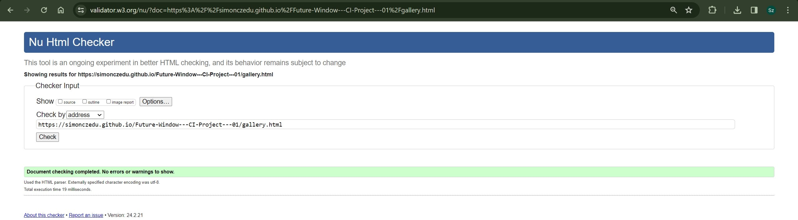
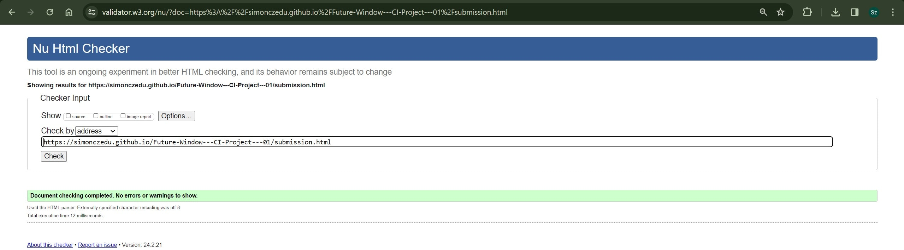
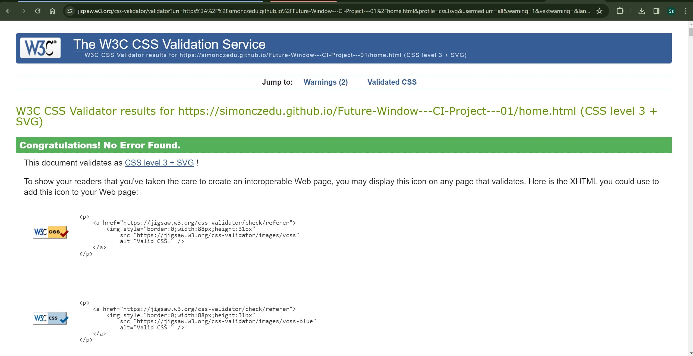

# Testing
## Code Validation
The Future Windows site has be thoroughly tested. All the code has been run through the [W3C html Validator](https://validator.w3.org/) and the [W3C CSS Validator](https://jigsaw.w3.org/css-validator/). Minor errors were found on the all pages. After a fix and retest, no errors were returned for any of the pages tested. 

The HTML validator results for each page are below:

* Logo page

* Home page

* Gallery page

* Contact us page

* Form validation page

The CSS validator results are below:

## Responsiveness Test

* The responsive design tests were carried out manually with [Google Chrome DevTools](https://developer.chrome.com/docs/devtools/) and [Responsive Design Checker](https://www.responsivedesignchecker.com/checker.php?url=https%3A%2F%2Fsimonczedu.github.io%2FFuture-Window---CI-Project---01%2F&width=1920&height=1200).

|        | Moto G4 | Galaxy S5 | iPhone 5 | iPad | iPad Pro | Display <1200px | Display >1200px |
|--------|---------|-----------|----------|------|----------|-----------------|-----------------|
| Render | pass    | pass      | pass     | pass | pass     | pass            | pass            |
| Images | pass    | pass      | pass     | pass | pass     | pass            | pass            |
| Links  | pass    | pass      | pass     | pass | pass     | pass            | pass            |

## Testing User Stories

* As a user I want to be able to navigate through the whole site smoothly.
    * Navigation is at the top of every page in the form of the **navigation menu**.
    * Navigation menu is always on screen due to it's fixed position. On user input it can be hidden with a checkbox. This is in the spirit of: "there when you need it, gone when you don't" 
    * In the the Gallery section, there are an additional links to the two section of the Gallery: Light and Cold.

     
* As a user I want to understand the purpose of the site upon loading it.
    * Home page is answering three questions: Who, What, How. This is so users know from the start who/what the Future Windows is; what they do and how they do it. 

     
* As a user I want to easily be able to contact Future Windows for more information.
    * On the **contact us** page there are contact details.
    * On the **contact us** page there is also a **form** for ease of contact.
    * On the **contact us** page users can find a map, to find and visit Future Windows

     
* As a user, I want to see product samples.
    * The **Gallery** page features responsive gallery of photos divided into to sections: Light and Cold.

     
* As a user, I want to be able to provide a feedback/ask questions directly to the company.
    * On the **contact us** page form provides an option to put in feedback in text area.

     
* As a user I want to connect with Future Windows on social media.
    * In the **footer** of every page there are some **social media links** to Future Windows social media pages. 
    * Same as navigation links, these can be hidden on user input.

## Known Bugs
* ### Resolved

    * Background not scaling properly with responsive site - Fixed with proper flex-box application (credit to Osin - tutor - for help in figuring it out)

    * Menu icon position not scaling properly with view port size - fixed by changing units from rem to vh.

    * Icons from font awesome for menu not scaling properly - fixed by changing units from rem to vh.

    * Galaxy Fold side view needs adjusting - solution: @media query.

    * Minor bug: While in dev tool mode when resizing browser window by dragging it to the edge and selecting split option, scaling is thrown out of balance. Low priority as it only happens in dev mode. No fix yet, but workaround is to close the window and reopen it (refresh with cache clear does not work).

    * Footer bug: With original code when social-toggle was switched social links were not included in display:none of the footer because it was followed but display:flex. - Fixed by removing unnecessary code from the footer.

    * Header bug: After adding new page links to products.html, new links were not aligning properly - solved by dividing nav into 3 ul's: menu-1, menu-2, menu-3 and styling them with flexbox. Idea to align new links under products link was suggested to me by my wife Marta Furman which also be mentioned in acknowledgements.

    * Styling bug: When user "zooms in/out" with ctrl+mouse scroll (for example), styling is not evenly applied on all pages. When inspecting with dev tools, it reverts to working properly. It is also fixed by setting "zoom" to 100% value. Reason: browser seems to commit zoom to cache. Ie. when home page is zoomed in to 200% and products remains default 100%, there will be discrepancies in page display. If both values are set same issue goes away. This is internal browser "feature" that presents it self as a bug on a page.

    * Couple of bugs found on validation. Missing closing tags; moved tags; section changed to div's where there was no need for h2-h6; - all fixed before revalidating.

* ### Unresolved

    * Minor bug: While in dev tool mode when resizing browser window by dragging it to the edge and selecting split option, scaling is thrown out of balance. Low priority as it only happens in dev mode. No fix yet, but workaround is to close the window and reopen it (refresh with cache clear does not work).
    * Map throws warnings in dev tools. Error is from the add blocker (user specific, and so unavoidable).
    

## Additional Testing
### Lighthouse
The site was also tested using [Google Lighthouse](https://developers.google.com/web/tools/lighthouse) in Chrome Developer Tools to test each of the pages for:
* Performance - How the page performs whilst loading.
* Accessibility - Is the site accessible for all users and how can it be improved.
* Best Practices - Site conforms to industry best practices.
* SEO - Search engine optimization. Is the site optimized for search engine result rankings.

As an example the results for Future Windows home page are below:

### Peer review
In addition to the above testing the beta version of the site was put through its paces by peers, both in the software development field and outside. The results highlighted responsive design weakness for a type of mobile device that was rectified with minor CSS amendments. There were also minor spelling and grammar errors that have since been addressed.

Back to [README.md](./README.md#testing).